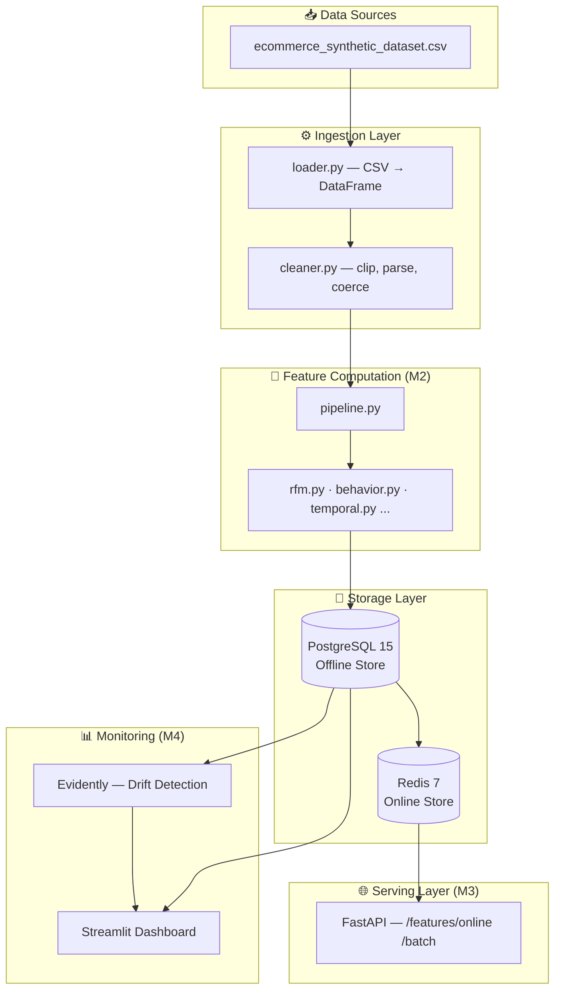

# Feature Store MVP

> Production-grade feature store for e-commerce ML serving.
> Ingests transaction data, computes 20+ user-level features in batch,
> serves them via a low-latency REST API, and monitors freshness & drift.

**Status:** 🚧 Milestone 1 complete — Foundation & Data Layer ✓

> **Full specification:** [`PRD.md`](PRD.md) · **Engineering conventions:** [`CLAUDE.md`](CLAUDE.md)

---

## Architecture



## Tech Stack

| Layer | Technology |
|-------|-----------|
| Language | Python 3.11+ |
| API | FastAPI + Uvicorn |
| Validation | Pydantic v2 + pydantic-settings |
| Data processing | Pandas + Polars |
| Offline store | PostgreSQL 15 (SQLAlchemy 2.0 + Alembic) |
| Online store | Redis 7 |
| Orchestration | Prefect 2.x |
| Monitoring | Streamlit + Evidently |
| Testing | pytest + pytest-cov |
| Linting | Ruff + Black + Mypy |
| Dev infra | Docker Compose |

## Prerequisites

- Python 3.11 or newer
- Docker + Docker Compose (for PostgreSQL + Redis)
- `make` (optional — wraps all common commands)

## Quick Start

```bash
# 1. Clone and enter the project
git clone <repo-url> && cd feature-store-mvp

# 2. Copy the env template and (optionally) edit credentials
cp .env.example .env

# 3. Install dependencies + pre-commit hooks
make setup          # runs: pip install -e ".[dev]" && pre-commit install

# 4. Bring up PostgreSQL + Redis
make up             # runs: docker compose up -d
# Wait ~10 s for healthchecks to pass, then:
docker compose ps   # both services should show "(healthy)"

# 5. Move the dataset into place (see "Dataset Setup" below), then seed the DB
python scripts/seed_data.py

# 6. Run the test suite
make test           # runs: pytest (with coverage)

# 7. Lint & type-check
make lint           # runs: ruff check . && mypy src/
```

## Services (Docker Compose)

| Service | Image | Default port | Purpose |
|---------|-------|-------------|---------|
| `postgres` | `postgres:15-alpine` | 5432 | Offline feature store (historical data) |
| `redis` | `redis:7-alpine` | 6379 | Online feature store (low-latency serving) |

Both services define healthchecks, use named Docker volumes
(`postgres_data`, `redis_data`), and read credentials from `.env`.

## Dataset Setup

This project uses the **E-Commerce Synthetic Dataset** (100k rows × 21 columns,
synthetic, CC0 Public Domain). The file is **not committed to git**.

The CSV (`ecommerce_synthetic_dataset.csv`) currently lives in the project root.
Move it into place before running `seed_data.py`:

```bash
# bash / git-bash
mv ecommerce_synthetic_dataset.csv data/raw/ecommerce_synthetic_dataset.csv
```

```powershell
# PowerShell
Move-Item ecommerce_synthetic_dataset.csv data\raw\ecommerce_synthetic_dataset.csv
```

More details: [`data/README.md`](data/README.md).

## Project Structure

```
src/
  config.py            Pydantic Settings — reads .env
  ingestion/           loader, schema, cleaner
  features/            RFM, behavior, engagement, temporal, discount, demographics (M2)
  storage/             SQLAlchemy models, offline (PG) + online (Redis) stores (M2-M3)
  api/                 FastAPI app + routes (M3)
  orchestration/       Prefect flows (M4)
  monitoring/          Drift detection + freshness (M4)
  dashboard/           Streamlit app (M4)

tests/
  conftest.py          Shared fixtures
  unit/                Pure function tests (no DB needed)
  integration/         End-to-end tests (requires Docker services)
  fixtures/            10-row sample CSV

scripts/
  seed_data.py         DB init + ingestion validation
  recompute_features.py  Manual feature recompute trigger (M2)
  benchmark_api.py     Latency load test (M3)

alembic/              Alembic migrations (initial schema in versions/001)
docs/                 Architecture, API spec, feature catalog, runbook
```

## Milestones

| # | Milestone | Status | ETA |
|---|-----------|--------|-----|
| **M1** | **Foundation & Data Layer** | ✅ **Done** | Week 1 |
| M2 | Feature Computation Engine (20+ features) | 🔜 Next | Week 2-3 |
| M3 | Serving Layer (FastAPI + Redis) | ⏳ | Week 3-4 |
| M4 | Monitoring & Dashboard | ⏳ | Week 4-5 |

Target API latency: p99 < 100 ms (single user lookup).

## Testing

```bash
pytest                         # all tests + coverage report
pytest tests/unit/ -v          # unit tests only (no Docker needed)
ruff check . && mypy src/      # lint + type-check
```

Module coverage targets (per `PRD.md § 16`):

| Module | Target |
|--------|--------|
| `src/ingestion/` | ≥ 85% |
| `src/features/` | ≥ 90% |
| `src/storage/` | ≥ 80% |
| `src/api/` | ≥ 80% |
| Overall | ≥ 80% |

## Database Migrations

Alembic is configured to read credentials from `.env` via `src/config.settings`:

```bash
# Apply all migrations (requires `make up` first)
alembic upgrade head

# Roll back one step
alembic downgrade -1

# Generate a new migration after changing ORM models
alembic revision --autogenerate -m "describe change"
```

## License

MIT — see `pyproject.toml`.
